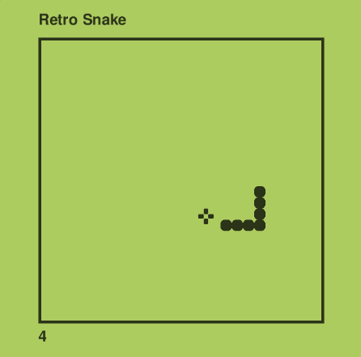

# Retro Snake Game Built Using PyGame

Welcome to the **Retro Snake Game** repository! This project showcases a classic Snake game developed using [PyGame](https://www.pygame.org/), a popular library for creating games in Python.

## Play the Game

You can experience the Retro Snake Game directly in your browser by visiting: [https://thunder-bird-interactive.itch.io/retro-snake](https://thunder-bird-interactive.itch.io/retro-snake)

## Preview



## Getting Started

To run the game locally, clone this repository and follow the instructions below:

1. Install [Python](https://www.python.org/) if you haven't already.
2. Install the PyGame library using pip:

    ```bash
    pip install pygame
    ```

3. Run the game:

    ```bash
    python retro-snake.py
    ```